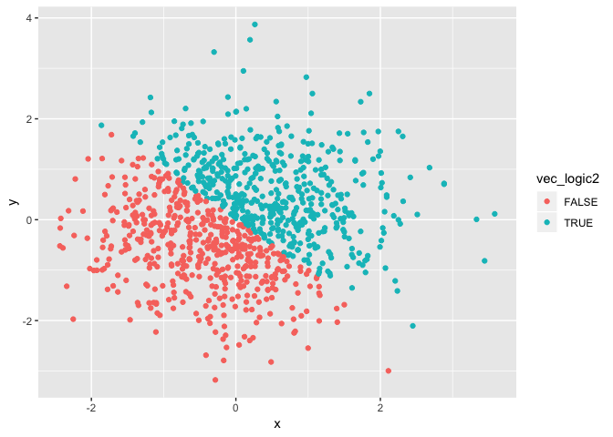
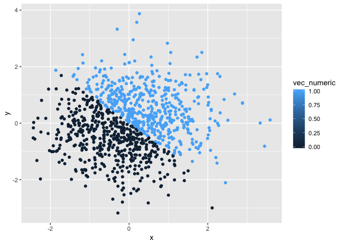
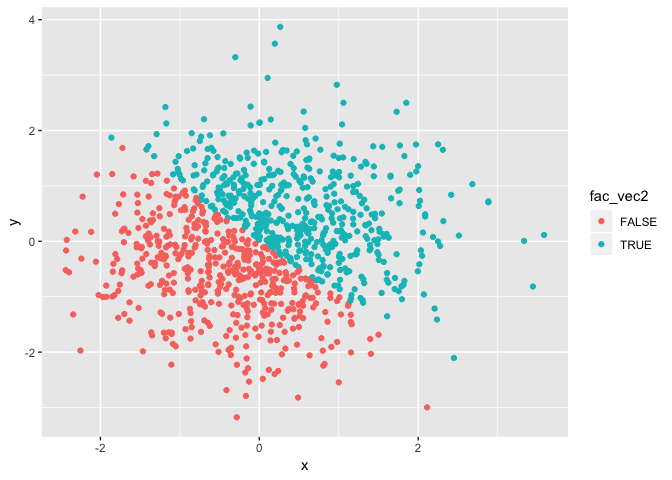

p8105\_hw1\_jt3098
================

Problem 1
---------

``` r
# create a seed to ensure the fixed value of the random number
set.seed(10)
rsample <- runif(10, min = 0, max = 5)
vec_logic <- rsample > 2
char_vec <- vector(mode = "character", length = 10)
fac_vec <- factor(x = character(10))

data_frame <- tibble(
  rsample,
  vec_logic,
  char_vec,
  fac_vec
)
```

``` r
mean(rsample)
```

    ## [1] 1.918583

``` r
mean(vec_logic)
```

    ## [1] 0.5

``` r
mean(char_vec)
```

    ## Warning in mean.default(char_vec): argument is not numeric or logical:
    ## returning NA

    ## [1] NA

``` r
mean(fac_vec)
```

    ## Warning in mean.default(fac_vec): argument is not numeric or logical:
    ## returning NA

    ## [1] NA

-   Discussion: The mean of rsample and vec\_logic work, but the mean of char\_vec and fac\_vec do not work, possibly because taking mean requires that each variable cannot be null.

``` r
as.numeric(vec_logic)
as.numeric(char_vec)
as.numeric(fac_vec)
```

-   Discussion: Logical: TRUE becomes 1; FALSE becomes 0. Character: All the character variables become NA. Factor: All the variables become 1.

``` r
as.factor(char_vec)
as.numeric(char_vec)
as.character(fac_vec)
as.numeric(fac_vec)
```

-   Discussion: In this case, because I did not give value to the character and factor vector, so they both could not be converted to numeric. However, generally speaking, if there is no null variable, character can be converted to factor and then to numeric. If factor vector comprises of "1", "2"... Then it can be converted to character and then numeric. If it consists of letters like "a", "b", then it can be converted to character but not to numeric.

Problem 2
---------

``` r
set.seed(1029)
x <- rnorm(1000)
set.seed(702)
y <- rnorm(1000)
vec_logic2 <- x + y > 0
vec_numeric <- as.numeric(vec_logic2)
fac_vec2 <- as.factor(vec_logic2)
data_frame2 = tibble(
  x,
  y,
  vec_logic2,
  vec_numeric,
  fac_vec2
)
```

-   Discussion: The size of the dataset is 33896 bytes. The mean of x is 0.02487248, and the median of x is 0.014856. The proportion of TRUE in the logical vector is 0.507.

``` r
ggplot(data_frame2, aes(x = x, y = y, color = vec_logic2)) + geom_point()
```



``` r
ggsave("scatter_plot.pdf")
```

    ## Saving 7 x 5 in image

``` r
ggplot(data_frame2, aes(x = x, y = y, color = vec_numeric)) + geom_point()
```



``` r
ggplot(data_frame2, aes(x = x, y = y, color = fac_vec2)) + geom_point()
```



-   Disccusion: The scatterplot with logical vector color scale only has 2 options (TRUE and FALSE), because logical vector itself can only give people 2 types of value (TRUE and FALSE) for a certain variable. So, it is discrete. The scatterplot with numeric vector color scale has a continuous spectrum, because numeric vector can give people many values (numbers) for a certain variable. The scatterplot with factor vector color scale only has 2 options (TRUE and FALSE), because in this case, factor vector can only give people 2 levels of value (TRUE and FALSE) for a certain variable. However, in other cases, it may give more than 2 levels. It is also discrete.
